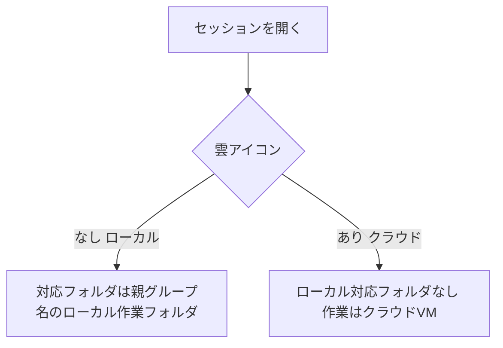

# Cursor セッション一覧

Agents パネル（Projects / Repositories）に表示されていたセッションを、2026-09-21 時点のスクリーンショットから整理した表です。

このドキュメント自体はクラウドエージェント「Cursorセッション表」で作成しており、表の対象には含めていません。

## 列の定義

| 列 | 意味 |
| --- | --- |
| 実行場所 | 画面の雲アイコンの有無。なし＝ローカル、あり＝クラウド |
| 対応リポジトリ | 紐づく Git リモート。未接続なら「なし」、確認できない場合は「不明」 |
| 対応フォルダ | **そのセッションを開いたときに作業ディレクトリになる、SSD 上のローカル作業フォルダ**。紐づかなければ「なし」。絶対パスが取れない場合はフォルダ名のみ確定し、パスは「不明」 |
| パネル上のグループ | サイドバーのフォルダ見出し。クラウドでも表示名として残るが、作業フォルダそのものではない |
| 最終アクティビティ | 画面の相対時刻。基準日は 2026-09-21 |
| UI状態 | 選択中（青ドット）/ ピン留め / 通常 |
| 推定テーマ | タイトルから読める目的 |
| 向き | なぜローカルまたはクラウドが妥当か |
| 注意点 | 取り違え・制約・再開時の留意 |
| その他の特徴 | 1 行の補足 |

### 対応フォルダの判定

- 雲アイコンなし（ローカルエージェント）: 親グループ名のフォルダが作業フォルダになる。SSD 上の実フォルダに紐づく。このクラウド実行からは手元ディスクが見えないため、**フォルダ名は確定、絶対パスは不明**。
- 雲アイコンあり（クラウドエージェント）: 作業場所はクラウド VM 上のクローン。手元 SSD のフォルダは自動では開かない。**対応フォルダなし**。
- 手元で確認できない事項は **不明**。

## セッション一覧

| セッション名 | 実行場所 | 対応リポジトリ | 対応フォルダ | パネル上のグループ | 最終アクティビティ | UI状態 | 推定テーマ | 向き | 注意点 | その他の特徴 |
| --- | --- | --- | --- | --- | --- | --- | --- | --- | --- | --- |
| Stream Deck status inquiry | ローカル | なし | `local_cursor_general`（絶対パス不明） | `local_cursor_general` | 6h | 通常 | Stream Deck の状態確認 | 手元デバイスに触るためローカル向き | クラウド VM からは Stream Deck に届かない | 汎用ローカル作業フォルダ上の問い合わせ |
| HOME Assistant MCP usage | ローカル | なし | `local_cursor_general`（絶対パス不明） | `local_cursor_general` | 7h | 通常 | Home Assistant MCP の使い方確認 | 手元 MCP を使うためローカル向き | 本番設定の変更なら `homeassistant` グループと取り違えない | HA 本番リポではなく汎用フォルダ側 |
| Claude monitor処... | クラウド | [pineroom/HOMEAssistant](https://github.com/pineroom/HOMEAssistant) | なし | `homeassistant` | 3h | 選択中・ピン留め | Claude Monitor に Cursor 表示を追加 | Git 上の HA 設定を PR にする作業のためクラウド向き | 手元の `homeassistant` フォルダは自動では開かない。ライブ HA への MCP はクラウドでは別設定が必要 | 実行名「Claude monitor処理表示」。ブランチ `cursor/claude-monitor-cursor-display-9a17`。[PR #1](https://github.com/pineroom/HOMEAssistant/pull/1) |
| Set up claude_qzss en... | クラウド | 不明 | なし | `claude_qzss`（1つ目） | 12h | 通常 | `claude_qzss` のクラウド環境セットアップ | スナップショットや環境構築はクラウド向き | 同名グループが 2 つある。手元フォルダは開かない | GitHub URL・ブランチは不明 |
| AI agent migration strategy | ローカル | 不明 | `grokbot_to_otherai`（絶対パス不明） | `grokbot_to_otherai` | 10h | 通常 | AI エージェント移行方針の検討 | ローカルフォルダ上の検討・草案向き | 公開 pineroom リポに同名は見当たらない | GitHub 接続の有無は不明 |
| Aiエージェントシステム... | クラウド | 不明 | なし | `claude_qzss`（2つ目） | 19h | 通常 | AI エージェントシステムの構築・運用 | クラウド上の継続作業向き | `claude_qzss` が二重表示。1つ目の環境セットアップセッションと別グループ | GitHub URL・ブランチは不明。別名クローンかは不明 |
| Item classification and stor... | ローカル | なし（ローカルフォルダのみ／GitHub 未確認） | `ssd_vault`（絶対パス不明） | `ssd_vault` | 9h | 通常 | SSD 上のアイテム分類と保管 | vault 実体が SSD にあるためローカル必須 | クラウド VM からはそのディスクが見えない | ファイル実体を扱う |
| Saving files in ssd_vault | ローカル | なし（ローカルフォルダのみ／GitHub 未確認） | `ssd_vault`（絶対パス不明） | `ssd_vault` | 12h | 通常 | `ssd_vault` へのファイル保存 | 実ファイル書き込みのためローカル必須 | 開くと `ssd_vault` が作業フォルダになる | 保管先そのものがテーマ |
| YouTube map view inquiry | ローカル | なし（ローカルフォルダのみ／GitHub 未確認） | `ssd_vault`（絶対パス不明） | `ssd_vault` | 19d | 通常 | YouTube の地図表示に関する調査 | vault 内ノート前提ならローカル向き | 最終アクティビティが最も古い | 再開時は内容の鮮度に注意 |

## ローカル vs クラウド

セッション行にメリット／デメリットを全部書くと冗長なため、型としての比較はここに置く。

| | ローカル | クラウド |
| --- | --- | --- |
| 開いたときの作業場所 | SSD 上の作業フォルダ（パネルの親グループ） | クラウド VM 上のクローン。手元フォルダは開かない |
| 利点 | 手元 MCP・USB/SSD・Stream Deck・未 git のファイルに直接触れる。起動が軽い | PC オフでも継続、並列実行、ブランチと PR、成果物、共有 URL |
| 欠点 | PC が必要、並列しづらい、PR 自動化が弱い | Git 接続リポ前提。ローカルディスク・機器不可。MCP とシークレットはクラウド側設定。環境未整備だとセットアップが先 |
| 向く作業 | デバイス確認、MCP、vault 上のファイル分類・保存 | リポの実装、環境構築、PR 作成 |
| 手元フォルダを使うには | そのローカルセッションを開く | ローカルへのハンドオフが別操作 |

## 不明点

- すべてのローカル対応フォルダの絶対パス（このクラウド実行からは手元 SSD が見えない）
- `claude_qzss` と `grokbot_to_otherai` の GitHub URL
- `claude_qzss` がサイドバーで二重になっている理由（別クローン／別環境の可能性）
- `ssd_vault` が Git リポジトリかどうか
